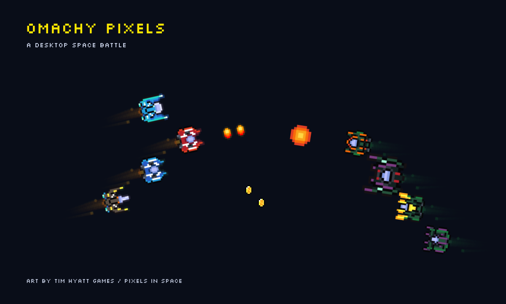

# Omachy Pixels

An offline pixel-art space battle for the Omarchy desktop. Friendly ships and enemies fly patrols, trade shots, explode, and collect coins. Bosses arrive in shuffled rounds. A ship icon in the bar opens a black, yellow, and white settings panel with the bundled Silkscreen pixel font.

Created by **Tim Hyatt of Tim Hyatt Games**, featuring original artwork from **Pixels In Space**, an upcoming Steam game.



## Requirements

- Omarchy Quattro with its Quickshell plugin system and Hyprland integration.
- QtQuick, QtQuick Controls, and Quickshell's Wayland, Hyprland, and Io modules, supplied by that environment.
- No runtime network access, Node.js, Python, system package installation, or API keys. Node.js and Python 3 are needed only for development checks.

This is a **service + bar-widget** plugin; it is not a generic Waybar widget. It was tested on an Omarchy Quattro desktop with two monitors. There is no support guarantee for older Omarchy versions or other compositors.

## Install

```bash
omarchy plugin add https://github.com/plasticcupgames/Omachy-Pixels --enable
```

The plugin defaults to the right bar section. To reposition it:

```bash
omarchy bar move plasticcupgames.omachy-pixels --section right
```

No install hook or privileged command runs. Omarchy manages the plugin checkout and enabled state. Another desktop mate is not required.

## Controls

Left-click the red-and-white ship icon to open settings on that monitor. Middle-click pauses/resumes the fleet. The icon remains available when the fleet is disabled or automatically hidden.

| Setting | Behavior |
| --- | --- |
| Fleet power | Enable/Disable saves across restarts. Disable stops the simulation and retains the settings icon. |
| Battle monitor | Choose one connected display. Falls back to the first connected display if the preferred monitor is absent. |
| Ship size | 1x, 2x, 3x; friendly bullets and thrusters match. |
| Enemy size | 1x, 2x, 3x; enemy bullets and thrusters match; also scales bosses. |
| Frequency | High, Moderate, Light adjust population, firing rate, respawns, and boss intervals. |
| Area | Full, Top, Bottom. Top/Bottom steer toward the outer 20% without clipping sprites or effects. |
| Pause | Temporarily freezes the fleet; separate from saved Enable/Disable. |

The fleet appears only on an empty desktop on its selected monitor. An application on that monitor's active workspace or an open special workspace hides the battle and stops the timer. It resumes on returning to an empty desktop. Apps on another monitor do not pause an empty battle desktop. The battle surface is below application windows and accepts no mouse or keyboard input. Ships cannot be dragged individually.

Friendly and enemy ships fly in squads of up to four, using V, echelon, and staggered-column formations. Wingmates follow their leader through loops, figure eights, and sweeps, and a surviving ship takes over when a leader falls. Separation steering reduces overlap, though crowded fleets can still cross. Engine trails follow movement, drift backward, and fade over 0.8 seconds. Friendly ships collect dropped coins. Regular enemies have green exhaust; bosses have no exhaust. Each shuffled round uses all three boss skins, with no consecutive repeats. One boss is active at a time; another can spawn at a later interval after it is destroyed.

| Frequency | Friendly / enemies | Respawn interval | Boss interval |
| --- | --- | --- | --- |
| High | 6 / 8 | 0.8 s | 40 s |
| Moderate | 4 / 5 | 1.5 s | 65 s |
| Light | 2 / 2 | 4 s | 120 s |

Timers advance only while the simulation runs. The default first boss is due after 35 simulation seconds; changing frequency resets the boss countdown to the selected interval.

### Terminal controls

```bash
omarchy-shell pixels settings
omarchy-shell pixels pause
omarchy-shell pixels setEnabled false
omarchy-shell pixels setEnabled true
omarchy-shell pixels screen HDMI-A-1  # replace with your output name
omarchy-shell pixels fps 20
omarchy-shell pixels boss
omarchy-shell pixels status
```

The repository's `./omachy-pixels` script provides the same controls. FPS defaults to 30; reducing it can lower rendering cost.

## Update and remove

```bash
omarchy plugin update plasticcupgames.omachy-pixels
omarchy plugin disable plasticcupgames.omachy-pixels
omarchy plugin remove plasticcupgames.omachy-pixels
```

Removal uses Omarchy's confirmation flow and removes only the plugin checkout and shell registration. It retains preferences in `${XDG_STATE_HOME:-$HOME/.local/state}/omachy-pixels-settings.json`. Delete that one file manually if you want to reset preferences. Scores and pause state are session-only. No system files or Hyprland configuration files are modified.

## Development

```bash
python3 tools/check-release.py
node tests/world.test.cjs
omarchy plugin validate .
```

For development, work from a normal Git checkout and use Omarchy's built-in plugin commands for installation, validation, updates, and removal. If hot reload keeps old QML components cached, `omarchy restart shell` applies the new code; this briefly restarts the bar and other shell services.

Do not run the old `local.omachy-pixels` development plugin alongside the published ID: both use the `pixels` IPC target and shared preferences. Disable the old plugin before enabling this release.

`Service.qml` owns preferences and IPC; `BarWidget.qml` exposes controls; `SettingsWindow.qml` renders the panel; `Battle.qml` renders cached sprites; `World.js` contains the testable simulation. Rendering uses one Canvas and one 30 Hz timer. Sprite/projectile/coin populations are bounded. Full-display Canvas rendering cost varies with resolution; this is not a performance benchmark. Very large sprites may not fit on very small displays.

## Publishing

See [Publish in three steps](docs/PUBLISHING.md) for the public repository,
manifest validation, and marketplace submission commands. The prepared
[submission draft](docs/MARKETPLACE-SUBMISSION.md) includes listing metadata.

The root preview is a staged scene rendered with the real Canvas and sprite
sheets. Regenerate it with `python3 tools/render-preview.py` (requires Qt 6's
`qml` tool); it contains no desktop screenshot or personal window content.

## Licensing and credits

Original code and documentation: MIT, see [LICENSE](LICENSE). Font and artwork have separate terms; see [THIRD_PARTY.md](THIRD_PARTY.md). All sprite artwork is by Tim Hyatt of Tim Hyatt Games for Pixels In Space; see [artwork terms](assets/LICENSE). Omate by Palccod provided the reference for Omarchy bar/service integration; its MIT notice is retained.
